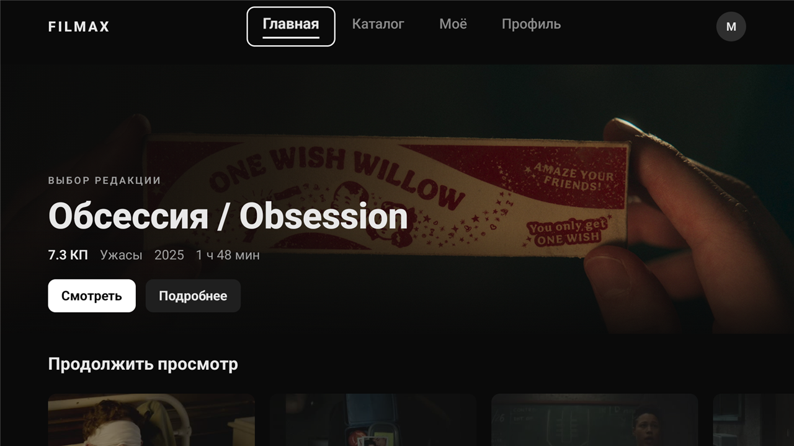
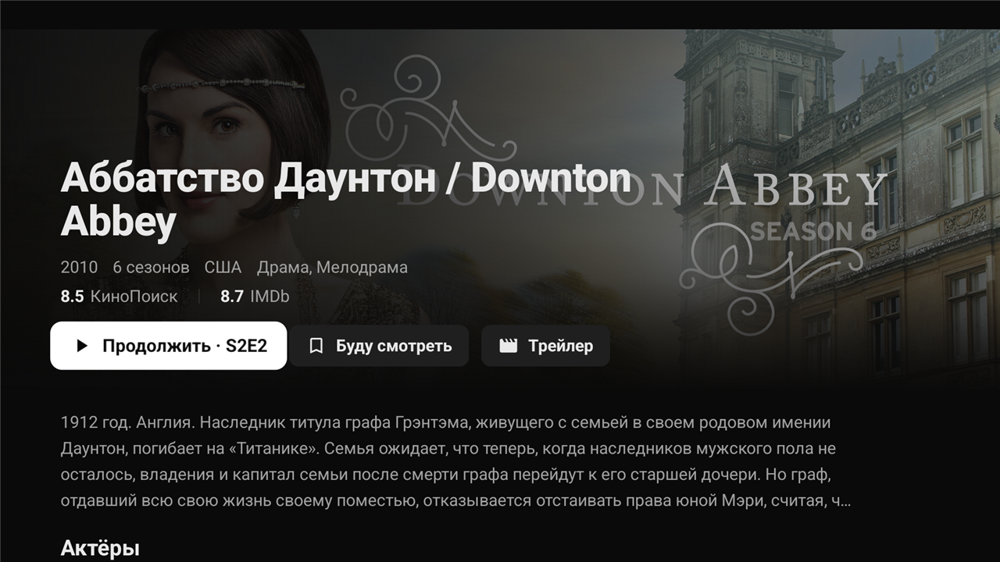
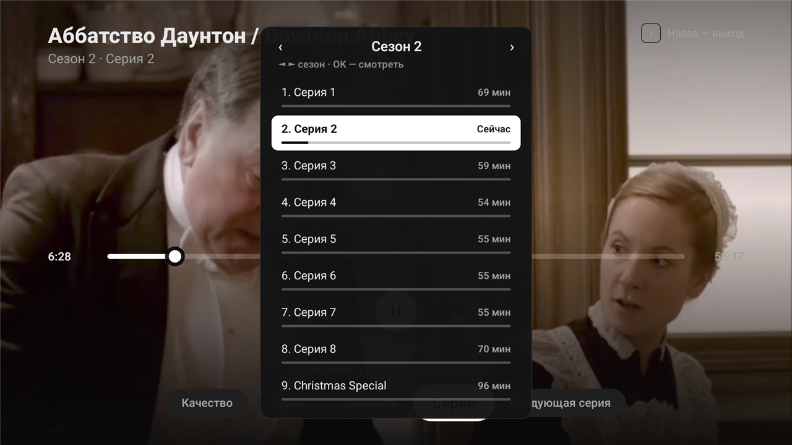
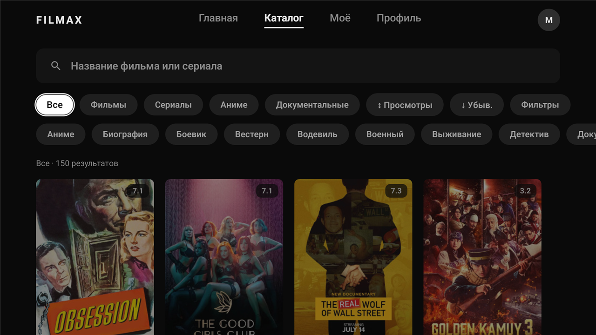
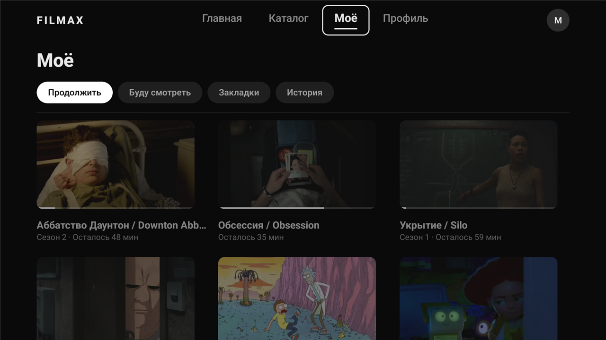
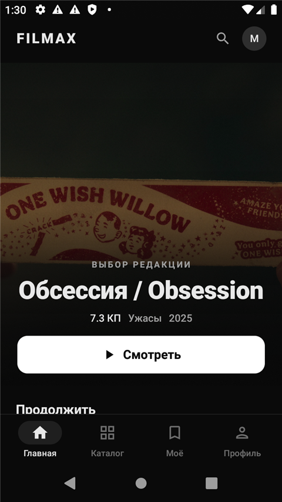
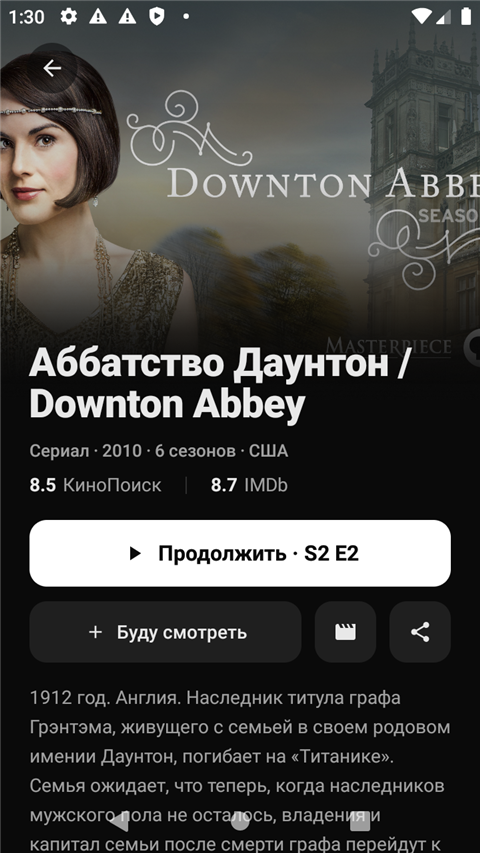

# Filmax

**Кинотеатр для телефона и Android TV в одном APK.** Неофициальный клиент kino.pub:
каталог с фильтрами, продолжение просмотра с точностью до серии, плеер с выбором озвучки
и субтитров, голосовой поиск и автообновления — 100% Kotlin, Jetpack Compose,
многомодульная архитектура.

[](https://github.com/malyi-m-dev/filmax/releases/latest)
[](#установка)
[](#стек)

> 📋 **[Доска задач (GitHub Projects)](https://github.com/users/malyi-m-dev/projects/1)** · 📦 **[Релизы](https://github.com/malyi-m-dev/filmax/releases)**

---

## Скриншоты

### Android TV — 10-foot UI под пульт



| | |
|:--:|:--:|
|  |  |
| *Карточка тайтла: «Продолжить · S2E2», серии, актёры* | *Плеер: панель сезонов и серий с прогрессом просмотра* |
|  |  |
| *Каталог: типы, жанры, сортировка, фильтры* | *«Моё»: продолжить, отложенное, закладки, история* |

### Телефон

<p align="center">
  
  &nbsp;&nbsp;
  
</p>

---

## Возможности

- **Один APK — два форм-фактора.** На телефоне — Material 3 с нижним таб-баром, на
  Android TV — монохромный 10-foot интерфейс под D-pad (`androidx.tv.material3`),
  выбор автоматический по `FEATURE_LEANBACK`.
- **Продолжение просмотра — с точностью до серии.** Прогресс синхронизируется с сервером;
  кнопка «Продолжить · S2E5» ведёт на недосмотренную серию, а после досмотренной — на следующую.
- **Плеер (Media3 ExoPlayer):** выбор качества, **полный список озвучек с названиями студий**,
  субтитры, скорость, перемотка с разгоном; на TV — панель сезонов/серий с прогрессом каждой
  серии прямо в плеере и переход к следующей серии.
- **Каталог:** типы, жанры, сортировка и расширенные фильтры (год, рейтинги КП/IMDb,
  страна, 4K, завершённость); экранная клавиатура на TV с **голосовым поиском внутри
  приложения** (SpeechRecognizer, без сторонних экранов).
- **Карточка тайтла:** рейтинги КП/IMDb раздельно, кликабельные актёры с фото (TMDB) и
  режиссёр → фильмография, трейлеры, сезоны и серии.
- **«Моё»:** продолжение, «Буду смотреть» (серверный watchlist + локальный кэш),
  папки-закладки, история.
- **Обновления приложения из GitHub Releases:** проверка при старте, скачивание с прогрессом
  и установка — без сторонних магазинов.
- **Офлайн-деградация:** кэшированный контент с баннером «нет сети» вместо экрана ошибки.

---

## Установка

1. Скачайте `filmax-X.Y.Z.apk` из [последнего релиза](https://github.com/malyi-m-dev/filmax/releases/latest).
2. Установите на телефон или Android TV — APK один для обоих.
3. Войдите по коду (OAuth2 device-flow) с аккаунтом kino.pub.

Дальше приложение обновляется само: увидев новый релиз, предложит скачать и установить.

---

## Стек

| Слой | Технологии |
|------|-----------|
| Язык | Kotlin 2.0 |
| UI (телефон) | Jetpack Compose (BOM 2025.05), Material 3, Coil 3 |
| UI (Android TV) | `androidx.tv.material3` — D-pad фокус, 10-foot UI |
| Навигация | Navigation Compose (типобезопасные routes на `@Serializable`) |
| DI | Koin 4 |
| Сеть | Ktor Client 3 + `kotlinx.serialization` (+ Chucker — инспектор запросов в debug) |
| Локальное хранилище | multiplatform-settings (избранное, настройки) |
| Плеер | Media3 ExoPlayer |
| Асинхронность | Coroutines + Flow |
| Сборка | AGP 8.7, convention plugins в `build-logic`, detekt |
| CI | GitHub Actions: debug → Telegram; тег `vX.Y.Z` → GitHub Release + Telegram |
| SDK | minSdk 26, target/compileSdk 35 |

---

## Архитектура

Многомодульная, разбита по слоям. Зависимости однонаправленные:
`app → feature → core/data → core:domain`.

### Один APK, два форм-фактора

Сборка одна (`:app`, один `applicationId`). Манифест объявляет `LAUNCHER` и
`LEANBACK_LAUNCHER`, поэтому APK ставится и на телефон, и на ТВ. `MainActivity`
выбирает граф навигации по типу устройства:

```kotlin
val isTv = packageManager.hasSystemFeature(PackageManager.FEATURE_LEANBACK)
if (isTv) FilmaxTvTheme { FilmaxTvNavGraph() } else FilmaxTheme { FilmaxNavGraph() }
```

### Вложенная структура фич

Каждая фича разбита на **логику** и **UI на форм-фактор** — TV не тянет на classpath
телефонный UI и наоборот, а логика (ScreenModel) не дублируется:

```
:feature:home            # логика: HomeScreenModel + *Contract + DI (без UI)
:feature:home:mobile     # телефонный Screen + navigation
:feature:home:tv         # TV Screen + navigation   (оба api-зависят от :feature:home)
```

```
app/                         # один таргет: телефон + Android TV
├─ MainActivity              # выбор UI по FEATURE_LEANBACK
├─ update/                   # in-app обновления из GitHub Releases
├─ navigation/               # FilmaxNavGraph (телефон, нижний таб-бар)
└─ tv/navigation/            # FilmaxTvNavGraph + TvTopNavBar (ТВ, верхний таб-бар)
core/
├─ domain/                   # модели, интерфейсы репозиториев, RequestResult, UseCase
├─ network/                  # сетевой клиент, токены, авторефреш OAuth
├─ presentation/             # BaseScreenModel (MVI: State/Event/SideEffect)
├─ designsystem/             # цвета, типографика, формы, тема (телефон)
├─ tv-designsystem/          # FilmaxTvTheme, TvPosterCard, TvFocusCard, TvRail (фокус из коробки)
└─ ui/                       # переиспользуемые Composable (PosterImage, голосовой ввод, …)
data/                        # реализации репозиториев + DTO + мапперы
└─ auth/ catalog/ search/ user/ watching/ tmdb/
feature/
├─ onboarding/ home/ search/ collections/ library/ profile/ details/ player/
│     └─ каждая: <feature>(логика) + <feature>:mobile + <feature>:tv
└─ designsystem/             # только телефон (каталог компонентов, debug)
```

> Для `details`/`player` маршрут (`DetailsRoute`/`PlayerRoute`) лежит в логическом модуле —
> его читает `ScreenModel` через `SavedStateHandle.toRoute<…>()`, а навбилдеры в
> `:mobile`/`:tv` ссылаются на него.

**Поток данных (MVI, однонаправленный):** `Composable` (`collectAsState` / `collectSideEffect`,
события через `dispatch(Event)`) → `ScreenModel` (`BaseScreenModel`, `State` + одноразовые
`SideEffect`) → `Repository` (`RequestResult<T>`: `Success` / `Error`) → сеть.

### Разделы

И на телефоне, и на ТВ — четыре раздела: **Главная · Каталог · Моё · Профиль**, плюс
push-экраны: карточка тайтла, фильмография, содержимое подборки, плеер, трейлер.
Поиск и подборки живут внутри Каталога.

Подробнее про TV — [`docs/TV.md`](docs/TV.md).

### iOS / Apple TV (KMP)

Параллельно с Android развивается Apple-версия: **общий `data`/`domain` из Kotlin Multiplatform**
(модуль `:shared`, фреймворк `Shared` + SKIE), а **презентейшен целиком на SwiftUI** — отдельные
таргеты `Filmax` (iPhone/iPad) и `Filmax-tvOS` (Apple TV) в `iosApp/`. ViewModel'и общие для обеих
платформ, различаются только View. Готово: точка входа + онбординг с авторизацией.

- Общий data/domain-слой для Swift (API, интероп SKIE, модели) — [`docs/ios-shared-layer.md`](docs/ios-shared-layer.md).
- Сборка на macOS (iOS + Android) — [`docs/BUILD_MACOS.md`](docs/BUILD_MACOS.md).
- Приложение и структура — [`iosApp/README.md`](iosApp/README.md).

---

## Сборка и запуск

Требуется JDK 17 и Android SDK 35.

```bash
# Debug APK (один — и на телефон, и на Android TV)
./gradlew :app:assembleDebug

# Установить на устройство/эмулятор
./gradlew :app:installDebug

# Статический анализ
./gradlew detekt
```

Опциональные ключи в `local.properties` (не коммитится):

| Ключ | Зачем |
|------|-------|
| `tmdb.apiKey` | Фото актёров из TMDB; без ключа — инициалы вместо фото |
| `demo.accessToken` / `demo.refreshToken` | Build type `demo`: APK стартует авторизованным (для демо-стендов) |
| `github.updateToken` | Не нужен, пока репозиторий публичный; на случай приватных релизов |

### CI и релизы

- **`android-build.yml`** — debug-APK на каждый пуш: Artifacts + Telegram
  (секреты `TELEGRAM_BOT_TOKEN`, `TELEGRAM_CHAT_ID`).
- **`android-release.yml`** — пуш тега `vX.Y.Z`: подписанный release-APK (R8),
  авто-changelog из conventional commits, публикация в GitHub Release и Telegram
  (плюс секреты подписи `KEYSTORE_*`). Установленное приложение подхватит релиз само.

---

## Дизайн

Дизайн ведётся в Claude Design и портируется поэкранно в Compose. Телефон — Material 3
с акцентом `#B4305A`; Android TV — **монохромный редизайн** (акцент — белый, фокус —
рамка с тёмным ореолом, работает на любом постере). Токены — в `core:designsystem` и
`core:tv-designsystem`. TV-макет: [`docs/design/filmax-tv-all-screens.html`](docs/design/filmax-tv-all-screens.html).

---

## Развитие

- [ ] Реальное офлайн-кэширование загрузок (сейчас только метаданные).
- [ ] Вернуть «Настройки устройства» в Профиль, когда бэкенд починит `device/*` (сейчас 500).
- [ ] Полноэкранный режим и регулировка громкости в плеере.
- [ ] iOS/Apple TV: остальные экраны на SwiftUI поверх `:shared`.
- [ ] Чистка ScreenModel-ей: UseCase-слой, убрать платформенные зависимости из presentation.

Техдолг и дорожная карта — в [`docs/REFACTORING_PLAN.md`](docs/REFACTORING_PLAN.md).

---

*Filmax — некоммерческий проект для личного использования. Требуется аккаунт kino.pub.*
