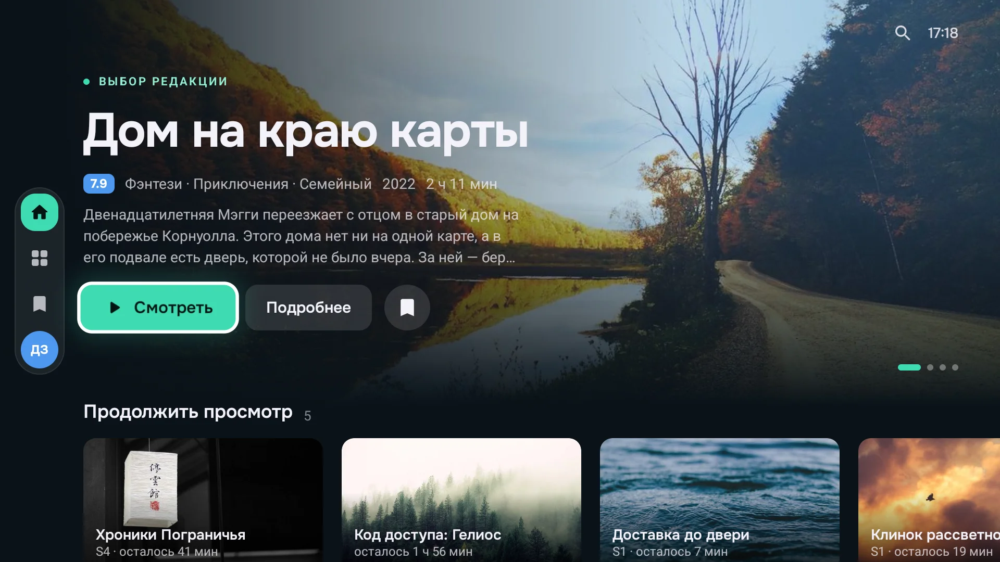
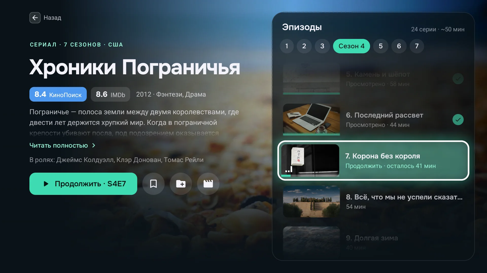
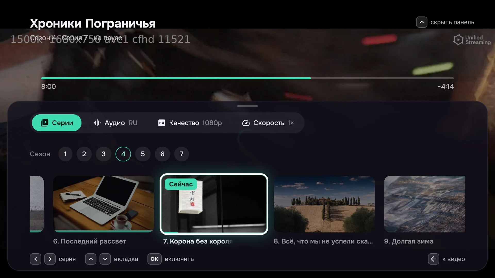
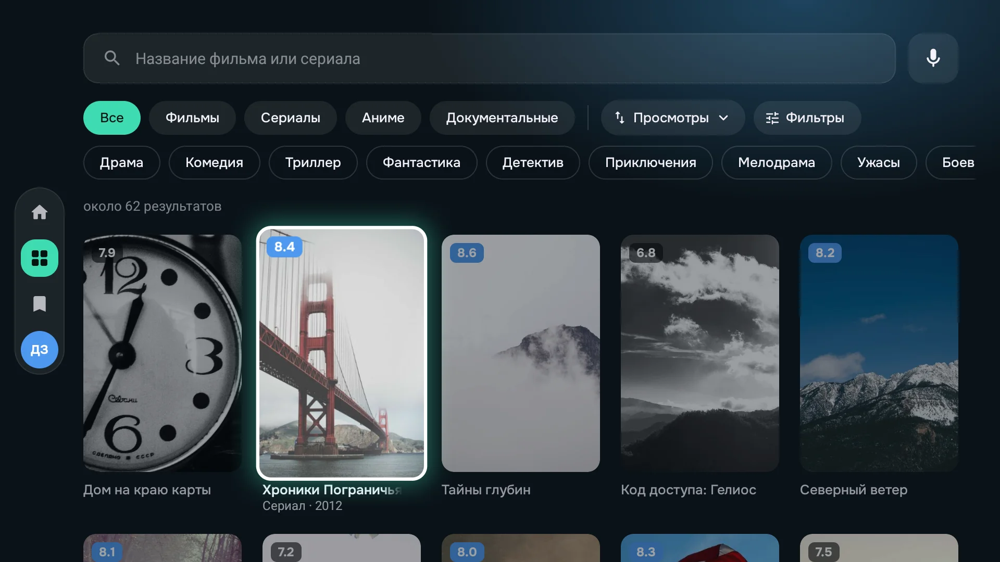
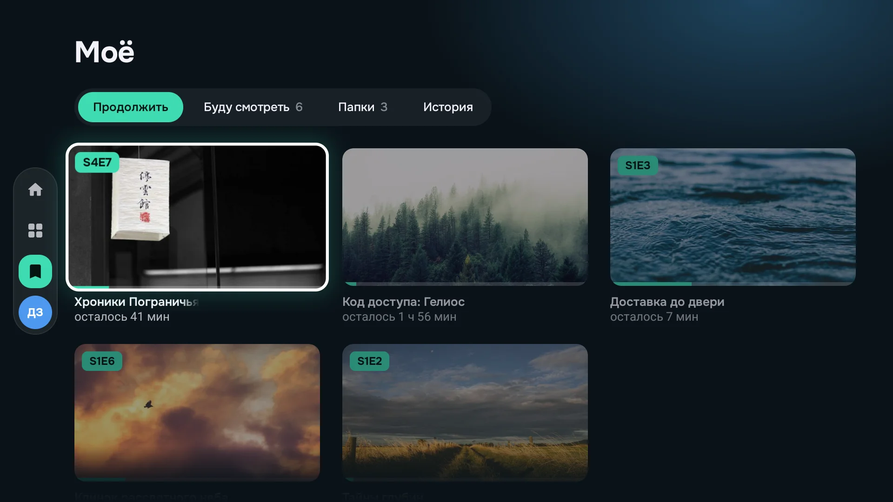
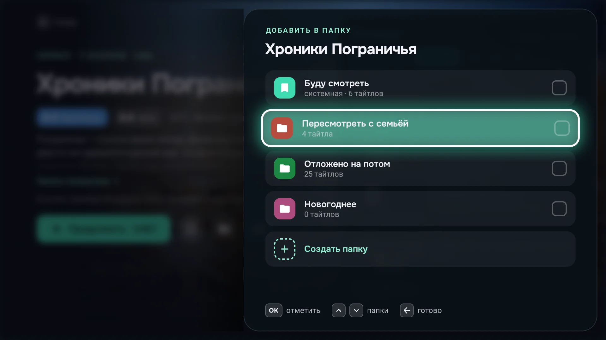
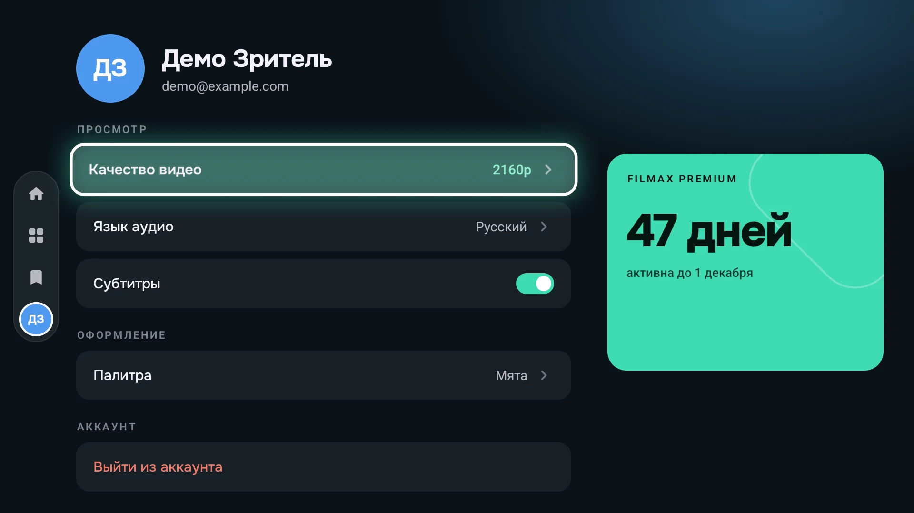

# Filmax

**Неофициальный клиент kino.pub для Android TV и телефона.** Один APK: на телевизоре —
интерфейс под пульт, на телефоне — под палец.

[](https://github.com/malyi-m-dev/filmax/releases/latest)
[](#установка)
[](docs/ARCHITECTURE.md)



| | |
|:--:|:--:|
|  |  |
| *Сериал открывается на серии, которую вы не досмотрели* | *Серии, озвучка и качество — прямо в плеере* |
|  |  |
| *Каталог с жанрами, сортировкой и фильтрами* | *«Моё»: продолжить, буду смотреть, папки, история* |
|  |  |
| *Тайтл — в любую папку прямо из карточки* | *Качество, озвучка, субтитры и палитра по умолчанию* |

<sub>Снято на mock-сборке: названия, описания и картинки выдуманы.</sub>

## Что умеет

**Смотреть дальше, а не искать, где остановился.** Прогресс хранится в kino.pub и общий для
всех ваших устройств. Кнопка «Продолжить · S4E7» ведёт ровно на недосмотренную серию, а после
досмотренной — на следующую. В конце серии следующая запускается сама, после короткого отсчёта.

**Плеер, в котором всё под рукой.** Качество вплоть до 4K, все озвучки с названиями студий,
субтитры и скорость. Сезоны и серии с прогрессом каждой листаются прямо поверх видео, не выходя
из плеера. Выбранная озвучка запоминается и включается на следующих сериях сама.

**Найти, что посмотреть.** На Главной — выбор редакции, «Продолжить просмотр», «В тренде»,
сериалы с высоким рейтингом и подборки. В Каталоге — фильмы, сериалы, аниме и документальное,
жанры, сортировка и фильтры по году, рейтингам КП и IMDb, стране, 4K и завершённости сериала.
Искать можно с клавиатуры телевизора или голосом.

**Всё о тайтле на одном экране.** Рейтинги КиноПоиска и IMDb, описание целиком, трейлер,
актёры с фото — и фильмография любого из них по нажатию.

**Своя полка.** «Буду смотреть», папки с цветом и названием (создаются прямо из карточки
тайтла) и история просмотров — всё в разделе «Моё».

**Удобно с пульта.** Крупный интерфейс для просмотра с дивана, боковое меню, фокус всегда
виден и возвращается туда, откуда вы ушли. Три палитры оформления на выбор.

**Обновляется само.** Новая версия приходит из GitHub Releases: приложение предложит скачать
и установить её без магазина приложений. Без сети показывает то, что уже загружено, а не
экран ошибки.

## Установка

1. Скачайте `filmax-X.Y.Z.apk` из [последнего релиза](https://github.com/malyi-m-dev/filmax/releases/latest).
2. Установите на Android TV или телефон — APK один для обоих.
3. Войдите по коду с аккаунтом kino.pub: код вводится на сайте с телефона или компьютера.

Нужен аккаунт kino.pub с активной подпиской. Android 8.0 и новее.

## Для разработчиков

Kotlin, Jetpack Compose (`androidx.tv.material3` на ТВ), Media3 ExoPlayer, Ktor, Koin.
Многомодульная архитектура: фича — общая логика (MVI) плюс отдельный UI для телефона и ТВ.
Data и domain — Kotlin Multiplatform, iOS-версия на SwiftUI в [`iosApp/`](iosApp/README.md).

```bash
./gradlew :app:installDebug   # обычная сборка
./gradlew :app:installMock    # без kino.pub и входа, на выдуманных данных
./gradlew detekt detektMain :app:assembleDebug testDebugUnitTest   # то, что гоняет CI
```

- [Архитектура, стек, сборка и релизы](docs/ARCHITECTURE.md)
- [Android TV: фокус, навигация, дизайн](docs/TV.md)
- [Правила проекта](CLAUDE.md) · [Changelog](CHANGELOG.md) · [Доска задач](https://github.com/users/malyi-m-dev/projects/1)

---

*Filmax — некоммерческий проект для личного использования, не связан с kino.pub.*
